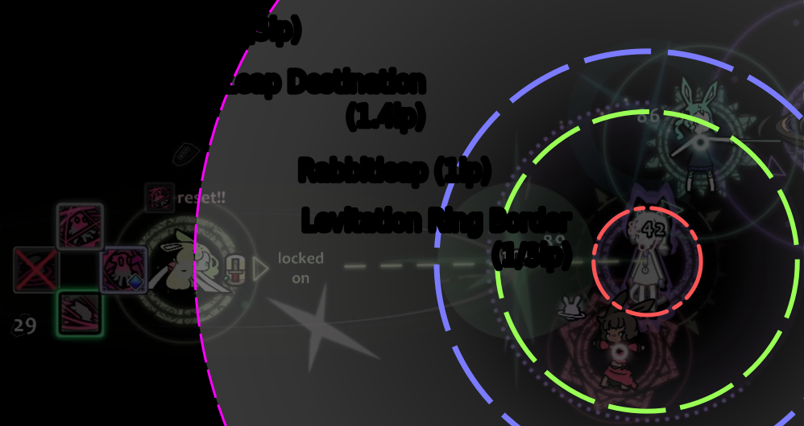
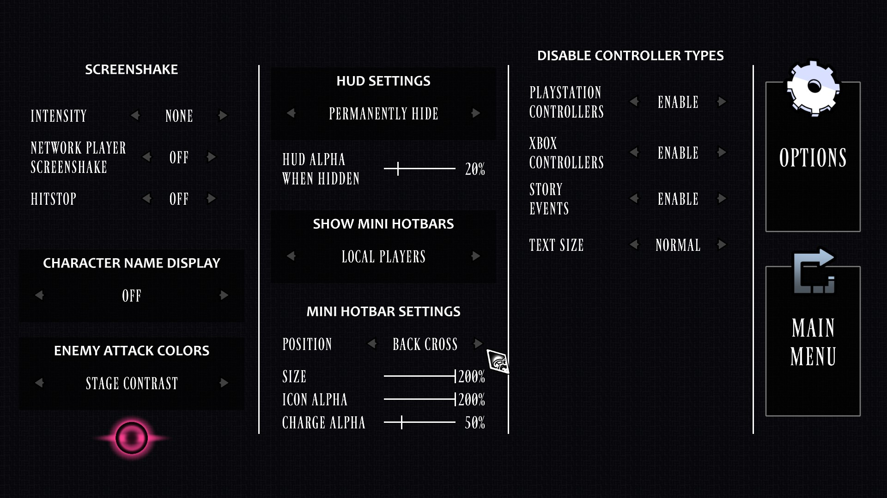
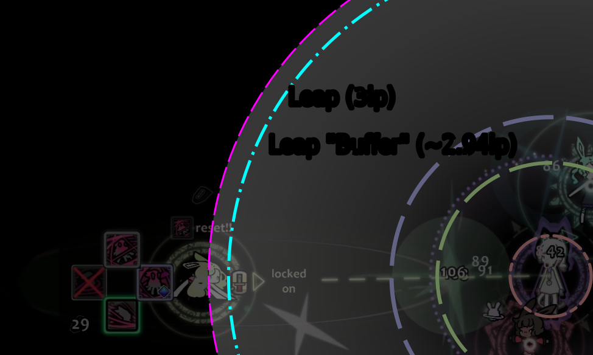

#+title: Something about Shadow
#+subtitle: ({{{guidever}}})
#+description: Unofficial Shadow Class guide for the Rabbit & Steel game.
#+author: Quoise
#+date: {{{modification-time(%Y-%m-%d)}}}
#+include: macros.org
:PREFERENCES:
#+startup: inlineimages
#+bind: org-latex-image-default-width "1.8em"
#+bind: org-latex-images-centered nil
#+bind: org-footnote-section nil
#+bind: org-hide-macro-markers t
#+OPTIONS: ^:nil num:3 todo:nil
#+EXPORT_FILE_NAME: index
#+LATEX_HEADER: \usepackage[colorlinks=true,urlcolor=pink,linkcolor=blue]{hyperref}
#+HTML_HEAD: <link rel="stylesheet" type="text/css" href="./styles/gongzhitaao-org.css"/>
#+HTML_HEAD: <link rel="stylesheet" type="text/css" href="./styles/hint.base.css">
#+HTML_HEAD_EXTRA: 
#+HTML_HEAD_EXTRA: 
#+HTML_HEAD_EXTRA: 
#+INFOJS_OPT: view:info sdepth:1 tdepth:1 path:'./js/org-info.js'
:END:
:TODOs:
#+TODO: TODO(t) DRAFT(D) | REVIEW(r)
#+TODO: | DONE(d)
#+TODO: | RENEW(R)
#+TODO: | CANCELLED(c)
:END:
:MACROS:
#+MACRO: gem [[./img/gems/$1.png]]
#+MACRO: gems [[./img/gems-40px/$1.png]]
#+MACRO: gemss [[./img/gems-40px/$1.png]]
#+MACRO: abl [[./img/abilities-40px/$1.png]]
#+MACRO: abls [[./img/abilities-40px/$1.png]]
#+MACRO: Shackle 
#+MACRO: Shackles {{{i1}}}{{{tShackles}}}{{{i2}}}{{{Shackle}}} {{{span_dot}}}Shackles{{{span_end}}}{{{i3}}}
#+MACRO: gamever v2.0.2.7
#+MACRO: guidever v0.4.1
#+MACRO: WIP @@html:@@WIP@@html:@@
:END:
:MACROS_ABBREVIATIONS:
#+MACRO: pri {{{abl(N1)}}} *Primary*
#+MACRO: sec {{{abl(N2)}}} *Secondary*
#+MACRO: secl {{{abl(N2)}}} *Leap Secondary*
#+MACRO: spe {{{abl(N3)}}} *Special*
#+MACRO: def {{{abl(N4)}}} *Defensive*
#+MACRO: N1 {{{i1}}}{{{tN1}}}{{{i2}}}{{{abls(N1)}}} {{{span_dot}}}N1{{{span_end}}}{{{i3}}}
#+MACRO: N2 {{{i1}}}{{{tN2}}}{{{i2}}}{{{abls(N2)}}} {{{span_dot}}}N2{{{span_end}}}{{{i3}}}
#+MACRO: N3 {{{i1}}}{{{tN3}}}{{{i2}}}{{{abls(N3)}}} {{{span_dot}}}N3{{{span_end}}}{{{i3}}}
#+MACRO: N4 {{{i1}}}{{{tN4}}}{{{i2}}}{{{abls(N4)}}} {{{span_dot}}}N4{{{span_end}}}{{{i3}}}
#+MACRO: O1 {{{i1}}}{{{tO1}}}{{{i2}}}{{{gems(O1)}}} {{{span_dot}}}O1{{{span_end}}}{{{i3}}}
#+MACRO: O2 {{{i1}}}{{{tO2}}}{{{i2}}}{{{gems(O2)}}} {{{span_dot}}}O2{{{span_end}}}{{{i3}}}
#+MACRO: O3 {{{i1}}}{{{tO3}}}{{{i2}}}{{{gems(O3)}}} {{{span_dot}}}O3{{{span_end}}}{{{i3}}}
#+MACRO: O4 {{{i1}}}{{{tO4}}}{{{i2}}}{{{gems(O4)}}} {{{span_dot}}}O4{{{span_end}}}{{{i3}}}
#+MACRO: S1 {{{i1}}}{{{tS1}}}{{{i2}}}{{{gems(S1)}}} {{{span_dot}}}S1{{{span_end}}}{{{i3}}}
#+MACRO: S2 {{{i1}}}{{{tS2}}}{{{i2}}}{{{gems(S2)}}} {{{span_dot}}}S2{{{span_end}}}{{{i3}}}
#+MACRO: S3 {{{i1}}}{{{tS3}}}{{{i2}}}{{{gems(S3)}}} {{{span_dot}}}S3{{{span_end}}}{{{i3}}}
#+MACRO: S4 {{{i1}}}{{{tS4}}}{{{i2}}}{{{gems(S4)}}} {{{span_dot}}}S4{{{span_end}}}{{{i3}}}
#+MACRO: R1 {{{i1}}}{{{tR1}}}{{{i2}}}{{{gems(R1)}}} {{{span_dot}}}R1{{{span_end}}}{{{i3}}}
#+MACRO: R2 {{{i1}}}{{{tR2}}}{{{i2}}}{{{gems(R2)}}} {{{span_dot}}}R2{{{span_end}}}{{{i3}}}
#+MACRO: R3 {{{i1}}}{{{tR3}}}{{{i2}}}{{{gems(R3)}}} {{{span_dot}}}R3{{{span_end}}}{{{i3}}}
#+MACRO: R4 {{{i1}}}{{{tR4}}}{{{i2}}}{{{gems(R4)}}} {{{span_dot}}}R4{{{span_end}}}{{{i3}}}
#+MACRO: G1 {{{i1}}}{{{tG1}}}{{{i2}}}{{{gems(G1)}}} {{{span_dot}}}G1{{{span_end}}}{{{i3}}}
#+MACRO: G2 {{{i1}}}{{{tG2}}}{{{i2}}}{{{gems(G2)}}} {{{span_dot}}}G2{{{span_end}}}{{{i3}}}
#+MACRO: G3 {{{i1}}}{{{tG3}}}{{{i2}}}{{{gems(G3)}}} {{{span_dot}}}G3{{{span_end}}}{{{i3}}}
#+MACRO: G4 {{{i1}}}{{{tG4}}}{{{i2}}}{{{gems(G4)}}} {{{span_dot}}}G4{{{span_end}}}{{{i3}}}
#+MACRO: E1 {{{i1}}}{{{tE1}}}{{{i2}}}{{{gems(E1)}}} {{{span_dot}}}E1{{{span_end}}}{{{i3}}}
#+MACRO: E2 {{{i1}}}{{{tE2}}}{{{i2}}}{{{gems(E2)}}} {{{span_dot}}}E2{{{span_end}}}{{{i3}}}
#+MACRO: E3 {{{i1}}}{{{tE3}}}{{{i2}}}{{{gems(E3)}}} {{{span_dot}}}E3{{{span_end}}}{{{i3}}}
#+MACRO: E4 {{{i1}}}{{{tE4}}}{{{i2}}}{{{gems(E4)}}} {{{span_dot}}}E4{{{span_end}}}{{{i3}}}
#+MACRO: O1s {{{i1}}}{{{tO1}}}{{{i2}}}{{{gemss(O1)}}}{{{i3}}}
#+MACRO: O2s {{{i1}}}{{{tO2}}}{{{i2}}}{{{gemss(O2)}}}{{{i3}}}
#+MACRO: O3s {{{i1}}}{{{tO3}}}{{{i2}}}{{{gemss(O3)}}}{{{i3}}}
#+MACRO: O4s {{{i1}}}{{{tO4}}}{{{i2}}}{{{gemss(O4)}}}{{{i3}}}
#+MACRO: S1s {{{i1}}}{{{tS1}}}{{{i2}}}{{{gemss(S1)}}}{{{i3}}}
#+MACRO: S2s {{{i1}}}{{{tS2}}}{{{i2}}}{{{gemss(S2)}}}{{{i3}}}
#+MACRO: S3s {{{i1}}}{{{tS3}}}{{{i2}}}{{{gemss(S3)}}}{{{i3}}}
#+MACRO: S4s {{{i1}}}{{{tS4}}}{{{i2}}}{{{gemss(S4)}}}{{{i3}}}
#+MACRO: R1s {{{i1}}}{{{tR1}}}{{{i2}}}{{{gemss(R1)}}}{{{i3}}}
#+MACRO: R2s {{{i1}}}{{{tR2}}}{{{i2}}}{{{gemss(R2)}}}{{{i3}}}
#+MACRO: R3s {{{i1}}}{{{tR3}}}{{{i2}}}{{{gemss(R3)}}}{{{i3}}}
#+MACRO: R4s {{{i1}}}{{{tR4}}}{{{i2}}}{{{gemss(R4)}}}{{{i3}}}
#+MACRO: G1s {{{i1}}}{{{tG1}}}{{{i2}}}{{{gemss(G1)}}}{{{i3}}}
#+MACRO: G2s {{{i1}}}{{{tG2}}}{{{i2}}}{{{gemss(G2)}}}{{{i3}}}
#+MACRO: G3s {{{i1}}}{{{tG3}}}{{{i2}}}{{{gemss(G3)}}}{{{i3}}}
#+MACRO: G4s {{{i1}}}{{{tG4}}}{{{i2}}}{{{gemss(G4)}}}{{{i3}}}
#+MACRO: E1s {{{i1}}}{{{tE1}}}{{{i2}}}{{{gemss(E1)}}}{{{i3}}}
#+MACRO: E2s {{{i1}}}{{{tE2}}}{{{i2}}}{{{gemss(E2)}}}{{{i3}}}
#+MACRO: E3s {{{i1}}}{{{tE3}}}{{{i2}}}{{{gemss(E3)}}}{{{i3}}}
#+MACRO: E4s {{{i1}}}{{{tE4}}}{{{i2}}}{{{gemss(E4)}}}{{{i3}}}
#+MACRO: O1g {{{i1}}}(O1) {{{tO1}}}{{{i2}}}{{{gem(O1)}}}{{{i3}}}
#+MACRO: O2g {{{i1}}}(O2) {{{tO2}}}{{{i2}}}{{{gem(O2)}}}{{{i3}}}
#+MACRO: O3g {{{i1}}}(O3) {{{tO3}}}{{{i2}}}{{{gem(O3)}}}{{{i3}}}
#+MACRO: O4g {{{i1}}}(O4) {{{tO4}}}{{{i2}}}{{{gem(O4)}}}{{{i3}}}
#+MACRO: S1g {{{i1}}}(S1) {{{tS1}}}{{{i2}}}{{{gem(S1)}}}{{{i3}}}
#+MACRO: S2g {{{i1}}}(S2) {{{tS2}}}{{{i2}}}{{{gem(S2)}}}{{{i3}}}
#+MACRO: S3g {{{i1}}}(S3) {{{tS3}}}{{{i2}}}{{{gem(S3)}}}{{{i3}}}
#+MACRO: S4g {{{i1}}}(S4) {{{tS4}}}{{{i2}}}{{{gem(S4)}}}{{{i3}}}
#+MACRO: R1g {{{i1}}}(R1) {{{tR1}}}{{{i2}}}{{{gem(R1)}}}{{{i3}}}
#+MACRO: R2g {{{i1}}}(R2) {{{tR2}}}{{{i2}}}{{{gem(R2)}}}{{{i3}}}
#+MACRO: R3g {{{i1}}}(R3) {{{tR3}}}{{{i2}}}{{{gem(R3)}}}{{{i3}}}
#+MACRO: R4g {{{i1}}}(R4) {{{tR4}}}{{{i2}}}{{{gem(R4)}}}{{{i3}}}
#+MACRO: G1g {{{i1}}}(G1) {{{tG1}}}{{{i2}}}{{{gem(G1)}}}{{{i3}}}
#+MACRO: G2g {{{i1}}}(G2) {{{tG2}}}{{{i2}}}{{{gem(G2)}}}{{{i3}}}
#+MACRO: G3g {{{i1}}}(G3) {{{tG3}}}{{{i2}}}{{{gem(G3)}}}{{{i3}}}
#+MACRO: G4g {{{i1}}}(G4) {{{tG4}}}{{{i2}}}{{{gem(G4)}}}{{{i3}}}
#+MACRO: E1g {{{i1}}}(E1) {{{tE1}}}{{{i2}}}{{{gem(E1)}}}{{{i3}}}
#+MACRO: E2g {{{i1}}}(E2) {{{tE2}}}{{{i2}}}{{{gem(E2)}}}{{{i3}}}
#+MACRO: E3g {{{i1}}}(E3) {{{tE3}}}{{{i2}}}{{{gem(E3)}}}{{{i3}}}
#+MACRO: E4g {{{i1}}}(E4) {{{tE4}}}{{{i2}}}{{{gem(E4)}}}{{{i3}}}
:END:

* RENEW Intro
:PROPERTIES:
:CUSTOM_ID: h:intro
:END:

#+begin_center
@@html:<b><u>@@
This guide is in
@@html:@@
review phase.
@@html:@@
@@html:</b></u>@@

@@html:<b><u>@@
Please feel free to send any feedback or corrections in ~mino_dev~ Discord.
Additions would be welcome.
@@html:</b></u>@@
#+end_center

Post class-rework Shadow Class guide written primarily for {{{gamever}}} of Rabbit & Steel.

Primarily, the recommendations here are targetted as a carry at 4P Lunar
and high WR consistency and with tactless author bias.

#+begin_quote
[Author] I come from maining Dancer after 200 MP Lunar games.
On Shadow, currently, have 23 MP Lunar wins and 37 Hard wins.
#+end_quote

This guide could not be made possible without the help of other players in mino_dev Discord.

Special thanks to Obi Rod, Ins'Ania and Kero for early help.
# check to see if said players are okay with being mentioned in guide.

** DONE Related Resources
:PROPERTIES:
:CUSTOM_ID: h:related_resources
:END:

Details of Shadow's kit can be found in:
- [[https://rns.miraheze.org/wiki/Shadow][Shadow | Rabbit & Steel Wiki (rns.miraheze.org)]]
  
For latest available guides:
- [[https://discord.com/channels/496640298844422149/1238375581486288916][Guides Catalogue maintained by Stagz | mino_dev Discord (discord.com)]]

For community jargon:
- [[https://docs.google.com/document/d/1rrSEIEstdKtajTY1xkXWoQKw3BIz4eENyJBHiyqCKcU/edit?tab=t.0][Rabbit & Steel Community Jargon by tomeking (docs.google.com)]] 

# attributions and claims to not own used images of R&S Loot + Gems

** DONE Sample Definitions
:PROPERTIES:
:CUSTOM_ID: h:sample_definitions
:END:

- {{{N1}}}, {{{O1}}}, {{{S1}}}, {{{R1}}}, {{{E1}}}, {{{G1}}} :: _Normal_ and _gem_ variants of Primary.
- {{{R1}}}, {{{R2}}}, {{{R3}}}, {{{R4}}} :: _Ruby_ variants of each respectively: Primary, Secondary, Special and Defensive.
- $2' \ggg 3 > 1 > 4 > 2$ :: move priority for {{{R2}}}
  + {{{secl}}} ($2'$) is drastically favoured and clicked whenever available;
  + Followed by Special, Primary, Defensive and (non-leap) Secondary.
- AoE :: Area-of-Effect; typically used in context of hitting multiple enemies, e.g. fights in Churchouse or Sanctum.
# - BiS :: Best in Slot; universal best upgrade.
- oGCD :: Shadow's S3, S4; these can be used without sacrificing GCD time spent on other
- prio :: priority; typically what item/gems should be picked and by whom

** RENEW Changelog (Releases)
:PROPERTIES:
:CUSTOM_ID: h:changelog
:END:

- v0.1.x (2026-04-18) :: release with ability synergies, gem tier list and ability tier list
- v0.2.0 (2026-04-21) :: applied feedback changes to rotation, gems, items. Added Shadow section and todos.
  - v0.2.1 (2026-04-21) :: fixed versioning and added dating
- v0.3.0 (2026-05-02) :: added rotations, class summary, tooltips, other notes; moved gems again.
  - v0.3.1 (2026-05-02) :: fixed some grammar 
  - v0.3.2 (2026-05-14) :: corrected bad macro in item table, modified CSS,
    added abbreviations in gem tier list, headers are "fixed"
- v0.4.0 (2026-06-07) :: retyped and reordered gems and items again, actually fill item synergies
- v0.4.1 (2026-06-16) :: reordered some gems, review synergies, added o2/g3 as synergies, link repo's own JS/.css
  to avoid failed site loading.

* REVIEW Class Summary
:PROPERTIES:
:CUSTOM_ID: h:class_summary
:END:

Shadow is a mobile close-quarters bunny with a potent versatility; she excels when playing flexibly, due to {{{Shackles}}}.
Many of her effects are unique or inspired from other classes and effects.

Shadow is best characterized by having:
- Decent-damage and short GCD (1.0s) abilities
  + Close-Range multi-hit {{{abl(N1)}}} *Primary* and {{{abl(N2)}}} *Secondary* abilities
  + {{{abl(N2)}}} *Secondary* having a leap, similar to Heavyblade's (HB) Special
  + {{{abl(N3)}}} *Special* that hits all enemies on short CD
  + {{{abl(N4)}}} *Defensives* with damage and GCD
- Shares the fastest base movement speed (m/s) with Assassin (Sin)
- {{{Shackles}}} status effect

#+caption: Class Advantages Table
| Pros                                                     | Cons                                        |
|----------------------------------------------------------+---------------------------------------------|
| Unique, gacha-like effects                               | Defensive has GCD                           |
| Versatile and variety between runs                       | Complex rotations ({{{Shackles}}})                |
| Secondary invulnerability                                | Watching distance  for leap                 |
| 4P Support line in {{{O2}}} {{{G3}}}                                 | Weak Special builds                         |
| Consistent without % effects and overall good items/gems | Almost 0 hacky Rabbitluck 8k+ damage builds |
|                                                          | [MP] Contests many of Sin's items           |

** REVIEW Shackles
:PROPERTIES:
:CUSTOM_ID: h:shackles
:END:

Shadow's {{{Shackles}}} locks up one of her attacks[fn:attacks:Attacks include {{{pri}}}, {{{sec}}}, {{{spe}}}.] from use on any ability usage.
This is independent of any Magicklock trinket effects, cooldowns or item effects (e.g. {{{Lefthand-Cast}}}.)

# This doesn't feel as relevant, but I'll quote it.
#+begin_quote
[Author] As well, this can freeze up "input queues" where otherwise, on other characters, you could be able to hold multiple
attacks down.
#+end_quote

** REVIEW Inspirations from other Classes and Loot
:PROPERTIES:
:CUSTOM_ID: h:inspirations
:END:

Shadow gains some distinct effects that appear in other classes, namely:
- {{{S2}}}'s range and charge effect like Dancer's Secondary
- {{{G3}}} granting the Shadowcry buff, similar to Dancer's def
- {{{O2}}} granting Shadowcurse debuff, similar to Spellsword's (SS) def
- {{{G1}}} granting 100 damage 25% of the time to all enemies, is practically a {{{Brightstorm-Spear}}} and {{{Darkstorm-Knife}}}
# too exhaustive?
# - {{{S1}}}, {{{S4}}} oGCD's
# - {{{S1}}}, {{{G1}}} and {{{R4}}} automatic abilities (do not trigger items that require /use/, i.e. {{{Black-Wakizashi}}})

** REVIEW Gacha ability
:PROPERTIES:
:CUSTOM_ID: h:gacha
:END:

{{{E3}}} grants Shadow common access to, often loot-only or class-exclusive, effects like Berserk, Sap and Blackstrike.
This distinctly allows Shadow to build into debuffs, multi-hit (on Special); or support most Shadow builds.
- See [[https://rns.miraheze.org/wiki/Shadow][Shadow (rns.miraheze.org)]] for exhaustive list of effects.

* REVIEW Move Priority (/Rotations/)
:PROPERTIES:
:CUSTOM_ID: h:rotation
:END:

Shadow's abilities' damage are more "symmetrical" at base kit.
The base kit optimization below are in magnitudes of about \pm20dps (10%) and only
_only valid if attacks hit consistently_.

#+name: rotations
#+caption: Common Move Priorities off Base Kit
| Base*   | $3 > 1 > 4 > 2$                              |
| {{{R2}}} \lor {{{R4}}} | $2' \ggg 3 > 4 > 1 > 2$                         |
| {{{E2}}}      | $2 \ggg 3 > 4 > 1$                              |
| {{{S1}}} \lor {{{G1}}} | $2 > 4 > 1 > 3$                              |
| {{{R1}}}      | $\text{Repeat}(1'' \rightarrow 2' \lor 4) \gg \text{Base}$ |
| {{{S4}}} \lor {{{O4}}} | $4 > 3 > 1 > 2$                              |
| {{{E4}}}      | $4 > 1 > 3 > 2$                              |
@@html:
@@
*Based on MDP; in Outskirts, force {{{N4}}} by 6s and 21s (twice),
can reach 9 gold easier if the enemy is beaten by 22.5s.

Leaps are designated by $2'$; charge by $2''$.

{{{spe}}} (3) can be delayed for mobile enemies.
@@html:
@@

In fights with _multiple enemies_, like *Churchmouse Streets'* Matti's P2 mice ads or *Geode* Plee,
save your {{{spe}}} or {{{def}}} until they spawn.

For *Darkhouse Depths'* Darkbeast Tauros, due to her zoning,
use the late hit animations of {{{pri}}} and {{{def}}} to deal damage consistently.

** REVIEW Ruby Leap Archetypes - R2/R4
:PROPERTIES:
:CUSTOM_ID: h:ruby_leap
:END:
#+MACRO: pb @@html: <b>@@$1@@html: </b>@@

# link to short YT clip displaying this
For normal-sized enemies, play near 3 Rabbitleaps away.
1. Position near {{{pb(leap)}}} border;
2. If {{{sec}}} is--
   a. Available \rightarrow move outside (leap enables) and use {{{sec}}};
   b. {{{Shackles}}} \rightarrow Either--
      + Move inside to hit Primary/Defensive;
      + Special;
3. Repeat.

Larger enemies like *Red Darkhouse* Ranalie P2 allow you to leap without lunging forward.

#+name: fig:rabbitleap
#+CAPTION: Distances in Rabbitleaps (lp) with Stella

*** REVIEW Alt: Omegacharge Ruby Primary (R1)
:PROPERTIES:
:CUSTOM_ID: h:r1
:END:

# unnecessary to include?
Same principle to activate leap above:
1. One of {{{secl}}} / {{{S2}}} / {{{def}}};
2. {{{R1}}};
3. Repeat.

** REVIEW Auto-proc + oGCD's (S1/G1/R4 + S3/S4)
:PROPERTIES:
:CUSTOM_ID: h:auto-proc
:END:

Shadow, at base kit, is again somewhat GCD-limited.
Any ability that gets that skips contesting every the usual {{{pri}}} and {{{sec}}} is good.

- {{{S1}}}, {{{G1}}} and {{{R4}}} allows Shadow to focus {{{sec}}} in previous rotations;
- {{{S3}}} and {{{S4}}}, as oGCD's, while listed equal damage to base, can be thought of adding +200 damage ({{{N1}}}) every click.

* REVIEW Ability synergies
:PROPERTIES:
:CUSTOM_ID: h:ability_synergies
:END:

Unique or notable gem and item synergies are only presented.

Generic item damage bonuses are assumed:
- Most abilities/gems love multi-hits like {{{Shadow-Bracelet}}}, {{{Youkai-Bracelet}}}, Bleed items-, {{{Venom-Hood}}}, {{{Heavens-Codex}}}...
- Certain items like {{{Witchs-Cloak}}} and {{{Darkcloud-Necklace}}} become viable when Shadow has sufficient damage in loot items.

Also most gems here are universally good with {{{O2}}}, {{{G3}}} and {{{O4}}}.

** REVIEW Primary
:PROPERTIES:
:CUSTOM_ID: h:primary
:END:
#+MACRO: N1i {{{i(Waterfall-Polearm)}}} {{{i(Crane-Katana)}}}
#+MACRO: O1i {{{i(Sand-Shovel)}}} {{{i(Miners-Headlamp)}}} {{{i(Large-Anchor)}}} {{{i(Lefthand-Cast)}}}
#+MACRO: S1i {{{i(Crane-Katana)}}} {{{i(Windbite-Dagger)}}} {{{i(Giant-Stone-Club)}}} {{{i(Hexed-Blindfold)}}}
#+MACRO: R1i {{{N1i}}} {{{i(Firststrike-Bracelet)}}} {{{i(Garnet-Staff)}}}(\rightarrow {{{i(Obsidian-Hairpin)}}}) {{{i(Flamedancer-Dagger)}}}
#+MACRO: G1i {{{i(Crane-Katana)}}} {{{i(Colorful-Earrings)}}} {{{i(Lightning-Bow)}}} {{{i(Crown-of-Storms)}}} {{{i(Usagi-Kamen)}}} {{{i(Giant-Stone-Club)}}} {{{i(Vega-Spear)}}} {{{i(Hexed-Blindfold)}}}
#+MACRO: E1i {{{N1i}}} {{{i(Firststrike-Bracelet)}}} {{{i(Midsummer-Dress)}}} {{{i(Abyss-Artifact)}}} {{{i(Flamedancer-Dagger)}}} {{{i(Whiteflame-Staff)}}} {{{i(Hexed-Blindfold)}}}
#+MACRO: E1n "Needs" slow bypass, but best internal multi-hit and good snapshot buff synergy

| Gem | Gem Synergies           | Item Synergies | Notes                                                                                    |
|-----+-------------------------+----------------+------------------------------------------------------------------------------------------|
| {{{N1}}}  | {{{O2s}}} {{{G3s}}}                 | {{{N1i}}}            | Good class N1, main ability to click on base                                             |
| {{{O1}}}  | {{{O2s}}} {{{E3s}}} {{{S3s}}}             | {{{O1i}}}            | Weaker {{{G2}}} variant for {{{S3}}} + {{{S4}}} or {{{E3}}}                                                      |
| {{{S1}}}  | {{{O2s}}} {{{G3s}}}                 | {{{S1i}}}            | +100 on Secondary, more consistent than {{{G1}}} for single enemies                            |
| {{{R1}}}  | {{{O2s}}} {{{S2s}}} {{{R2s}}} {{{E2s}}} {{{O4s}}} {{{G3s}}} | {{{R1i}}}            | _600dmg on only iframe req_; easiest with {{{S2}}}, good with snapshot buffs                     |
| {{{G1}}}  | All (-{{{G2s}}}/-{{{R3s}}})         | {{{G1i}}}            | Avg +25 dmg on other ability hits, decent AoE and best % proc trigger without Rabbitluck |
| {{{E1}}}  | {{{O2s}}} {{{E3s}}} {{{O4s}}}             | {{{E1i}}}            | {{{E1n}}}                                                                                      |

#+begin_quote
{{{S1}}} and {{{G1}}} effects does not trigger "use" abilities like {{{Black-Wakizashi}}} or {{{Golden-Katana}}}, but can trigger {{{Brightstorm-Spear}}}.

{{{S1}}} and {{{G1}}} are fine with taking +GCD (includes {{{R1}}} to some extent.)

{{{E1}}} 2s GCD effect can't be cheated via GCD items, Berserk, Quickdraw or even {{{Shinsoku-Katana}}}.
At base kit, the effect triggers {{{Pocketwatch}}}, but not {{{Sacredstone-Charm}}}.
#+end_quote

** REVIEW Secondary
:PROPERTIES:
:CUSTOM_ID: h:secondary
:END:
#+MACRO: N2i {{{i(Butterfly-Hairpin)}}} {{{i(Cavers-Cloak)}}} {{{i(Vorpal-Dao)}}} {{{i(Falconfeather-Dagger)}}}
#+MACRO: O2i {{{n2i}}} {{{i(Artist-Smock)}}} {{{i(Redblack-Ribbon)}}}
#+MACRO: S2i {{{n2i}}} {{{i(Sandpriestess-Spear)}}} {{{i(Marble-Clasp)}}} {{{i(Hexed-Blindfold)}}}
#+MACRO: R2i {{{n2i}}} {{{i(Reddragon-Blade)}}} {{{i(Greysteel-Shield)}}} {{{i(Marble-Clasp)}}} 
#+MACRO: G2i {{{i(Jesters-Hat)}}} {{{i(Colorful-Earrings)}}} {{{i(Lightning-Bow)}}} {{{i(Crown-of-Storms)}}} {{{i(Usagi-Kamen)}}} {{{i(Rosered-Leotard)}}}
#+MACRO: E2i {{{n2i}}} {{{i(Hexed-Blindfold)}}}
#+MACRO: O2n SS superhex (universal damage mult.); scales loot and team damage, unlike others

| Gem | Leap | Gem Synergies   | Item Synergies | Notes                                                 |
|-----+------+-----------------+----------------+-------------------------------------------------------|
| {{{N2}}}  | Y    | {{{R4s}}} {{{G3s}}}         | {{{N2i}}}            | Good class N2                                         |
| {{{O2}}}  | Y    | All             | {{{O2i}}}            | {{{O2n}}}                                                   |
| {{{S2}}}  | -    | {{{R4s}}} {{{R1s}}} {{{S3s}}} {{{G3s}}} | {{{S2i}}}            | Ranged secondary and wide-hitbox, easy uptime         |
| {{{R2}}}  | Y    | {{{R4s}}} {{{O4s}}} {{{S3s}}} {{{G3s}}} | {{{R2i}}}            | _"Supercharge" double damage effect_ with only leap req |
| {{{G2}}}  | -    | {{{E3s}}} {{{S3s}}} {{{S4s}}} {{{G4s}}} | {{{G2i}}}            | Good with oGCD gems; loses Secondary damage           |
| {{{E2}}}  | Y    | {{{R4s}}} {{{G3s}}} {{{S3s}}}     | {{{E2i}}}            | Average upgrade due to {{{Shackles}}}                       |

#+begin_quote
#+end_quote

** REVIEW Special
:PROPERTIES:
:CUSTOM_ID: h:special
:END:
#+MACRO: N3i {{{i(Deathcap-Tome)}}} {{{i(Cursed-Candlestaff)}}} {{{Shockwave-Tome}}}
#+MACRO: O3i1 {{{i(Miners-Headlamp)}}} {{{i(Darkglass-Spear)}}} {{{i(Timespace-Dagger)}}} {{{i(Firststrike-Bracelet)}}} [ {{{i(Necronomicon)}}} / {{{i(Nova-Crown)}}} (\rightarrow {{{i(Battlemaiden-Armor)}}} )]
#+MACRO: O3i2  {{{i(Raindrop-Earrings)}}} {{{i(Sun-Pendant)}}} {{{i(Heavens-Codex)}}} {{{i(Staff-of-Sorrow)}}} {{{i(Mountain-Staff)}}}
#+MACRO: O3i {{{o3i1}}} {{{o3i2}}}
#+MACRO: S3i {{{n3i}}} {{{i(Hawkfeather-Fan)}}} {{{i(Mountain-Staff)}}} {{{i(Garnet-Staff)}}}  {{{i(Spear-of-Winds)}}} {{{i(Bolt-Staff)}}} {{{i(Mermaid-Scalemail)}}} {{{i(Firescale-Corset)}}}
#+MACRO: R3i {{{i(Obsidian-Rod)}}} {{{i(Garnet-Staff)}}} {{{i(Spear-of-Winds)}}} {{{i(Bolt-Staff)}}} {{{i(Saltwater-Staff)}}}
#+MACRO: G3i {{{n3i}}} {{{i(Sacred-Bow)}}} {{{i(Shrinemaidens-Kosode)}}} {{{i(Reflection-Shield)}}} {{{i(Spiked-Shield)}}}
#+MACRO: E3i {{{i(Hawkfeather-Fan)}}}(\rightarrow {{{i(Redwhite-Ribbon)}}}) {{{i(Sacred-Bow)}}} {{{i(Shrinemaidens-Kosode)}}} {{{i(Mermaid-Scalemail)}}} {{{i(Firescale-Corset)}}} {{{i(Artist-Smock)}}} {{{i(Witchs-Cloak)}}} {{{i(Venom-Hood)}}}
#+MACRO: S3n Good early damage increase as oGCD; no slow, loves CD reduction (0.8s hidden CD minimum)
#+MACRO: G3n Dancer Warcry (universal damage mult.); scales loot and team damage consistently (alt: {{{E3}}})

 | Gem | Gem Synergies              | Item Synergies | Notes                                                                 |
 |-----+----------------------------+----------------+-----------------------------------------------------------------------|
 | {{{N3}}}  | {{{O2s}}}                        | {{{N3i}}}            | Weaker class N3, but strong AoE (hits all) and decent debuff Spreader |
 | {{{O3}}}  | {{{O2s }}}(With item reset: {{{O1s}}}) | {{{O3i}}}            | Special damage scaling; huge hitting Special; disables universal %    |
 | {{{S3}}}  | {{{O1s}}} {{{G2s}}} {{{O2s}}}                | {{{S3i}}}            | {{{S3n}}}                                                                   |
 | {{{R3}}}  | {{{O1s}}} {{{G2s}}} {{{O2s}}}                | {{{R3i}}}            | Good for ads, Obsidian Rod or Special triggers                        |
 | {{{G3}}}  | All                        | {{{G3i}}}            | {{{G3n}}}                                                                   |
 | {{{E3}}}  | {{{E1s}}} {{{O1s}}} {{{G2s}}} {{{O2s}}}            | {{{E3i}}}            | More dmg on Special; debuff/buff archetype; inconsistent AoE          |

#+begin_quote
{{{E3}}} is affected by {{{Obsidian-Rod}}}, {{{Cursed-Candlestaff}}}, {{{Old-Bonnet}}} / {{{Haunted-Gloves}}} and other special items changes.
#+end_quote
 
** REVIEW Defensive
:PROPERTIES:
:CUSTOM_ID: h:defensive
:END:
#+MACRO: N4i {{{i(Gladiator-Helmet)}}} {{{i(Battery-Shield)}}} {{{i(Shadow-Bracelet)}}}
#+MACRO: O4i {{{N4i}}} {{{i(Beach-Sandals)}}} {{{i(Hermes-Bow)}}}  {{{i(Talon-Charm)}}} {{{i(Sacred-Bow)}}} {{{i(Coldsteel-Shield)}}} {{{i(Waterfall-Polearm)}}} {{{i(Crane-Katana)}}} {{{i(Vorpal-Dao)}}} {{{i(Falconfeather-Dagger)}}}
#+MACRO: S4i {{{N4i}}} {{{i(Coldsteel-Shield)}}} {{{i(Flamedancer-Dagger)}}} {{{i(Firststrike-Bracelet)}}}
#+MACRO: R4i {{{i(Tiny-Wings)}}} {{{i(Garnet-Staff)}}}(\rightarrow {{{i(Obsidian-Hairpin)}}}) {{{i(Peridot-Rapier)}}} {{{i(Greysteel-Shield)}}} 
#+MACRO: G4i {{{N4i}}} {{{i(Spark-of-Determination)}}}
#+MACRO: E4i {{{i(Firststrike-Bracelet)}}} {{{i(Starry-Cloak)}}}(\rightarrow {{{i(Timemage-Cap)}}}) {{{i(Timespace-Dagger)}}} {{{i(Bloodhound-Greatsword)}}} {{{i(Lonesome-Pendant)}}}

| Gem | Leap | Gem Synergies            | Item Synergies | Notes                                                    |
|-----+------+--------------------------+----------------+----------------------------------------------------------|
| {{{N4}}}  | -    | {{{O2s}}} {{{G3s}}}                  | {{{N4i}}}            | Has GCD; good burst for class N4 and Shackles reroll     |
| {{{O4}}}  | Y    | {{{R1s}}} {{{R2s}}} {{{O2s}}} {{{G3s}}}          | {{{O4i}}}            | *Leaps*; *+m/s*; allows clicking attacks most times          |
| {{{S4}}}  | -    | {{{O1s}}} {{{G1s}}} {{{R1s}}} {{{G2s}}} {{{O2s}}} {{{G3s}}}  | {{{S4i}}}            | oGCD burst damage early-game; but oGCD on 10s is bad     |
| {{{R4}}}  | -    | {{{O2s}}} {{{S2s}}} {{{R2s}}} {{{E2s}}} {{{G3s}}}      | {{{R4i}}}            | +300 on Leaps is amazing                                 |
| {{{G4}}}  | -    | {{{G1s}}} {{{G2s}}} {{{R3s}}} {{{O2s}}} {{{G3s}}}      | {{{G4i}}}            | Good Sanctum/Mice tech;                                  |
| {{{E4}}}  | -    | {{{G1s}}} {{{O2s}}} {{{E3s}}} {{{G3s}}}          | {{{E4i}}}            | Amazing burst, trivializes first two fights of midstages |

#+begin_quote
Worth saving Defensive to reroll {{{Shackles}}}, to line up
Wavestrike, Blacktrike, Flash-* and Vanish/Ghost effects, with for example, {{{E1}}}.

{{{Firststrike-Bracelet}}} or Blackstrike buff ({{{Book-of-Cheats}}}, {{{E3}}})
applies to Defensive damage without consuming it.
#+end_quote

* REVIEW Gems Tier List
:PROPERTIES:
:CUSTOM_ID: h:gems_tier_list
:END:

Tier placing prioritizes "lines" and WR by Lunar Shira/Witch of 900 DPS (~600 base DPS/level 1.)
- In >99% of runs, buy a gem first shop (most gems are damage positive)
  + If first stage is *Subterra Sanctum* or *Churchmouse Streets*, consider Special Gem, {{{G1}}}, {{{S2}}}, {{{G4}}} or {{{E4}}}.
    + Optionally, *Darkhouse Depths*, viable for Tauros if you're unable to hit {{{pri}}}'s detached hitbox consistently.
- [Player Trap] Special-only lines, including {{{R3}}} or ({{{O1}}}+{{{S3}}}), are _NOT VIABLE_ without strong item synergies.
- [MP] {{{R1}}}, {{{R4}}} is proccable from invulns like Druid Defensive and Gren R4.
- [4P MP] just auto-buy {{{O2}}} and {{{G3}}}.
- [5/20s Rabbitluck] {{{G1}}} is S-tier; {{{G2}}} and {{{R3}}} are B-tier

** RENEW Multipliers
:PROPERTIES:
:CUSTOM_ID: h:gems_s
:END:
Super-high damage standalones requiring only leap, accessible immediately through base kit.
They solve DPS easily with minimal synergies required.

{{{R4g}}}
{{{R2g}}}
{{{R1g}}}

Non-DPS carry gems but universal damage multipliers into any line.

{{{O2g}}}
{{{G3g}}}

#+begin_quote
- {{{R4}}} :: 580 base DPS on successive leaps is astounding.
  + If triggered every <5s, still _out-damages all other Shadow Defensive_ on base.
  + Leaps are free on Phase 2's of Witch and Shira (no leap movement at 3 Rabbitleaps.)
- {{{R2}}} :: +180 double damage on leaps (360 DPS on successive leaps).
  + Unlike {{{R4}}}, {{{R1}}} and {{{R2}}} typically have better item scaling.
- {{{R1}}} :: optimal $(2\rightarrow1)$ rotations yields 390 base DPS.

- {{{O2}}} and {{{G3}}} :: immediate and lategame universal damage multipliers on literally everything.
  + [4P] practically autobuy.
  + Excluding {{{R2}}} and {{{E3}}}, worth replacing other gems over,
    especially once you have any loot damage source or MP.
#+end_quote
   
** REVIEW Great
:PROPERTIES:
:CUSTOM_ID: h:gems_a
:END:
Weaker damage throughputs, but nonetheless safer and great options throughout the run.

{{{S1g}}}
{{{G1g}}}
{{{O4g}}}
{{{S2g}}}
{{{E3g}}}
    
#+begin_quote
- {{{S1}}} :: more consistent single-target DPS on non-leap _Secondary_ builds.
- {{{G1}}} :: in-class {{{Darkstorm-Knife}}} and amazing in Rabbitluck or when multiple enemies are present.
  + Very decent % trigger without Rabbitluck.
  + Similar to {{{S1}}} allowing extra damage on Secondary builds, but extended to Special and Defensive.

- {{{O4}}} :: moreso an attack damage/loot-trigger multiplier (scaling in late game.)
  + Unlike {{{S4}}}, in the same 10s span, {{{O4}}} allows an extra attack (11 vs S4's 10.)
  + In 5s buffs like Smite, allows 2-3 extra attacks.
  + Only internal "perma" speed that allows Shadow to take movement-slow items.

- {{{S2}}} :: amazing for damage uptime via ranged attacks, charge and wider area.
  + Consistent trigger for {{{R1}}}.

- {{{E3}}} :: good damage bump and utility tool (single/group buffs + debuffs.)
  + Enables {{{E1}}} and buff/debuff item lines.
  + Needs {{{O1}}}, {{{G2}}} or CD reduction for consistent triggers (but good on base.)
  + _Inconsistent AoE_.
#+end_quote

** REVIEW Good
:PROPERTIES:
:CUSTOM_ID: h:gems_b
:END:
Weaker gems that solve specific encounters exceedingly well, have certain downsides or broad synergies.

{{{E4g}}}
{{{G4g}}}
{{{S3g}}}
{{{E1g}}}

#+begin_quote
- {{{E4}}} :: high burst trivializing the first two fights in each midstage when used at t=0s+20s.
  + Highest burst when used with {{{G1}}} and Blackstrike buff ({{{E3}}}, {{{Firststrike-Bracelet}}}.)
  + Good _ads tech_ when timed.

- {{{G4}}} :: significant dmg increase that hits all AoE (good _ads tech_.)
  + The 10% luck is mediocre until at least three % synergies.
    
- {{{S3}}} :: 4s oGCD is pretty good; simplifies rotations and good early damage.
  + QoL {{{Shackles}}} reroll in an instant (e.g. clicking Primary in Flow-Str more.)
  + Damage falloff with no synergies.

- {{{E1}}} :: best damage for multi-hit/snapshot buffs, but painful without slow bypass (Berserk/Super/Flutterstep/{{{E3}}}).
#+end_quote

** REVIEW Conditionally good
:PROPERTIES:
:CUSTOM_ID: h:gems_c
:END:
Gems that are average or build-altering with very narrow synergies.

{{{S4g}}}
{{{O3g}}}
{{{R3g}}}
{{{E2g}}}
{{{G2g}}}
{{{O1g}}}

#+begin_quote
- {{{S4}}} :: QoL 10s oGCD with good early DPS. Falloffs harshly with no synergies.
  + 10s for an oGCD is bad, thus item/{{{G2}}}-dependant for scaling.
  + {{{Shackles}}} reroll in an instant, making it "quicker" to snapshot effects.

- {{{O3}}} :: highest base Special (exceptional for 1.0s GCD), good _ads tech_ option at base at 15s.
  + [MP] {{{O3}}} is pickable given other class O3's are not high base.
  + Losing potential % procs is typically insignificant, especially e.g. it solves Sanctum first stage with no synergies.
    - Fewer items to cheat the CD without %, but super-viable once online.

- {{{R3}}} :: good option Special-trigger loot effects ({{{Saltwater-Staff}}}) and AoE (_ads tech_), but a *player trap* otherwise.
  + 60% chance for it to whiff effect (into 4s CD) and 250 base is _super bad_.
  + Besides {{{O2}}}, no internal gem synergies and may become anti-synergistic late-game.
    (i.e. _GCD is contested_; and 10% luck {{{G4}}} provides is too inconsequential.)

- {{{E2}}} :: okay DPS option, but impossible to out-damage {{{R2}}} (and {{{S2}}} in most fights.) {{{O2}}} scales with itself and the rest of Shadow's kit.

- {{{G2}}} :: 0 dmg line-specific % gem, late-buy only (requires synergies), no leap or invuln.
  + Damage positive but high variance off base.
  + Without synergies, may kill runs if not clicking Primary.

- {{{O1}}} :: clicks Special and loot CD's more.
  + Effect ends up being awkward with 80% of loot items and Special's low base damage.
  + Most other gem picks scale better and bumps damage in most lines though.
#+end_quote

* REVIEW Item Tier List
:PROPERTIES:
:CUSTOM_ID: h:item_tier_list
:END:

Again, tier placing prioritizes "lines" and WR by Lunar Shira/Witch of 900DPS (~600 base DPS/level 1.)

- Shadow generally should be building {{{pri}}} and {{{sec}}} items.
  - [4P] Shadow should prio {{{sec}}} damage items higher (unless typically Sin, Dancer and Druid)
- Shadow, _for AoE_, may pick {{{spe}}} loots if:
  + Playing on Extra (guaranteed *Subterra Sanctum*.)
  + Shadow has Special gem.
  + Party has non-phenomenal total DPS and poor AoE.

#+begin_quote
Items are sorted by their name alphabetically.
#+end_quote

#+include: items.org :minlevel 2

* REVIEW Other Notes
:PROPERTIES:
:CUSTOM_ID: h:other
:END:

** REVIEW Avoiding leap PVP
:PROPERTIES:
:CUSTOM_ID: h:leap_pvp
:END:

For damage/consistency, see [[*Ruby Leap Archetypes - R2/R4][Ruby Leap Archetypes - R2/R4]]. To repeat:
- For {{{R1}}}/{{{R2}}}/{{{R4}}} leaps, leap near the leap distance (position) whenever you can.

Additionally,
- If avoiding leap, you may prioritize: {{{O1}}}, {{{S2}}}, {{{G2}}} and {{{R3}}} (avoid {{{O4}}})
- Spreads have a small end-window where you can leap without taking damage.
- {{{secl}}} \rightarrow {{{def}}} does not provide back-to-back invuln.
  + {{{def}}} \rightarrow {{{secl}}} does provide back-to-back invuln, but {{{sec}}} can roll {{{Shackles}}}.
- Use your [[*Turn on Mini Hotbar][mini hotbar]] to check if leap is enabled.

*** DONE Turn on Mini Hotbar
:PROPERTIES:
:CUSTOM_ID: h:mini_hotbar
:END:

#+MACRO: options ~Options>More Options~
#+MACRO: hotbar @@html: @@Mini Hotbar@@html:@@
In {{{options}}}, you can toggle and customize your {{{hotbar}}}. This allows you to see
your available abilities (and {{{Shackles}}}) adjacent to your hitbox.

An accent colour will border the Secondary if _leap is enabled,_ dependant on
Shadow palette.

#+caption: Mini Hotbar Settings

*** REVIEW Practices on Targetting
:PROPERTIES:
:CUSTOM_ID: h:targetting
:END:
#+MACRO: nt @@html: @@Nearest Target@@html:@@
#+MACRO: ct @@html: @@Change Target@@html:@@

# reminder to check default binds
Regarding player controls {{{nt}}} and {{{ct}}}.

If you're in a fight with multiple enemies, and you do _not want to leap_:
- identify your current target (and if they're low health)
- pressing {{{nt}}} prior to {{{sec}}}
- pressing {{{nt}}} after pressing {{{ct}}}

{{{ct}}} also allows to slow your character or attack the "centre" (in-between) of targets:
- alternatively, "tapping" movement keys for micromovements
- slowing down your rotation
- not holding attack buttons for prolonged periods.
  
** REVIEW Hidden Leap Disable Radius
:PROPERTIES:
:CUSTOM_ID: h:leap_buffer
:END:

After enabling leap on Secondary, disabling leap uses an inner "buffer" distance
(~2.94lp; ~2x size of Rabbit visible hitbox.)

#+name: fig:rabbitleap_buffer
#+CAPTION: Rabbitleap "Buffer" Disable Radius

* TODO Example Builds :noexport:
:PROPERTIES:
:CUSTOM_ID: h:builds
:END:

#  LocalWords:  dmg synergize pickable
